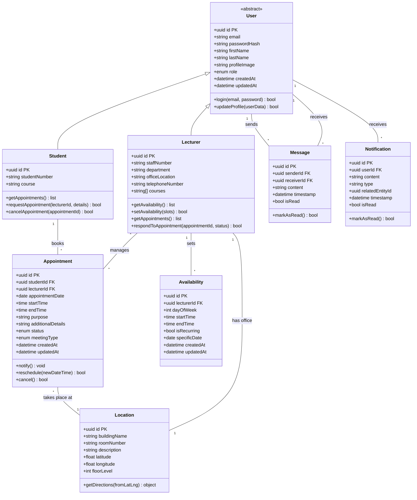

## Architectural Style
## Implementation approach

Based on the requirements outlined in the PRD, we'll design a web-based system using modern technologies that support real-time features, secure authentication, and responsive design. The system needs to handle two distinct user roles (students and lecturers) with different interfaces and capabilities.

### Key Technical Challenges

1. **User Role-Based Authentication**: Implementing secure, role-specific authentication for students and lecturers
2. **Availability Management**: Complex calendar system to manage lecturer availability and prevent scheduling conflicts
3. **Real-time Notifications**: Ensuring timely notifications for appointment requests, confirmations, and changes
4. **Campus Navigation Integration**: Integrating mapping functionality with office locations
5. **Messaging System**: Implementing secure, reliable communication between students and lecturers
6. **Data Consistency**: Maintaining data integrity across appointment scheduling and calendar systems

### Technology Stack Selection

**Frontend:**
- **React.js**: For building interactive component-based UI with efficient rendering
- **Tailwind CSS**: For responsive design and consistent styling
- **Redux**: For state management across the application
- **Socket.io (client)**: For real-time notifications and messaging

**Backend:**
- **Node.js**: Server runtime environment for JavaScript
- **Express.js**: Web framework for building robust APIs
- **Socket.io (server)**: For implementing WebSockets for real-time features
- **JWT**: For secure authentication and session management

**Database:**
- **PostgreSQL**: Relational database for structured data and complex relationships
- **Redis**: For caching and session management

**Mapping/Navigation:**
- **Mapbox API**: For campus mapping and navigation with custom overlays

**Deployment:**
- **Docker**: For containerization
- **Nginx**: For serving static assets and load balancing
- **AWS/Azure/GCP**: Cloud hosting platform

## Data structures and interfaces

### Database Schema

## Authentication and Authorization Flow

1. **Initial Access**:
   - Users arrive at the landing page with user role selection (student/lecturer)
   - Selection affects the login form and subsequent UI flow

2. **Authentication Process**:
   - User submits credentials (student/staff number and password)
   - Backend verifies credentials against database
   - Upon successful authentication, a JWT token is generated with role information
   - Token is returned to client and stored securely (HTTP-only cookie)

3. **Authorization**:
   - JWT contains user role and permissions
   - API endpoints verify token validity and role permissions
   - Different views and capabilities are presented based on role
   - Backend validates permissions for each request

4. **Session Management**:
   - JWT expiry set to reasonable timeframe (e.g., 24 hours)
   - Redis used to store token blacklist for logged-out users
   - Refresh token implementation for seamless experience

5. **Security Measures**:
   - HTTPS for all communications
   - CSRF token implementation
   - Rate limiting on authentication endpoints
   - Password hashing using bcrypt
   - Input validation on all endpoints
