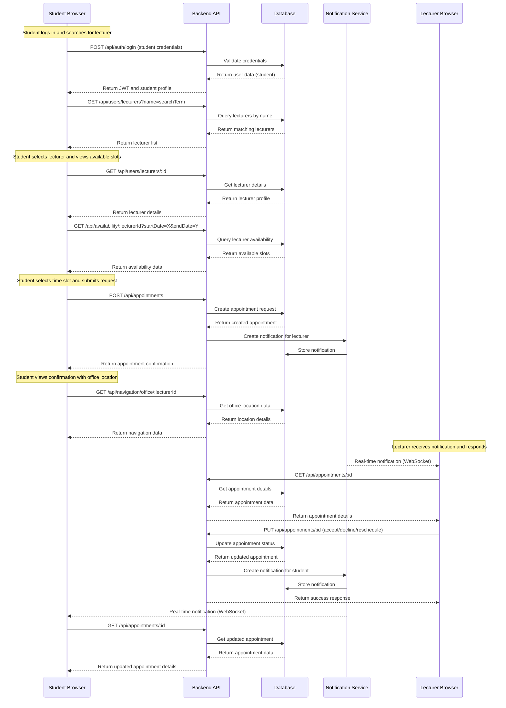
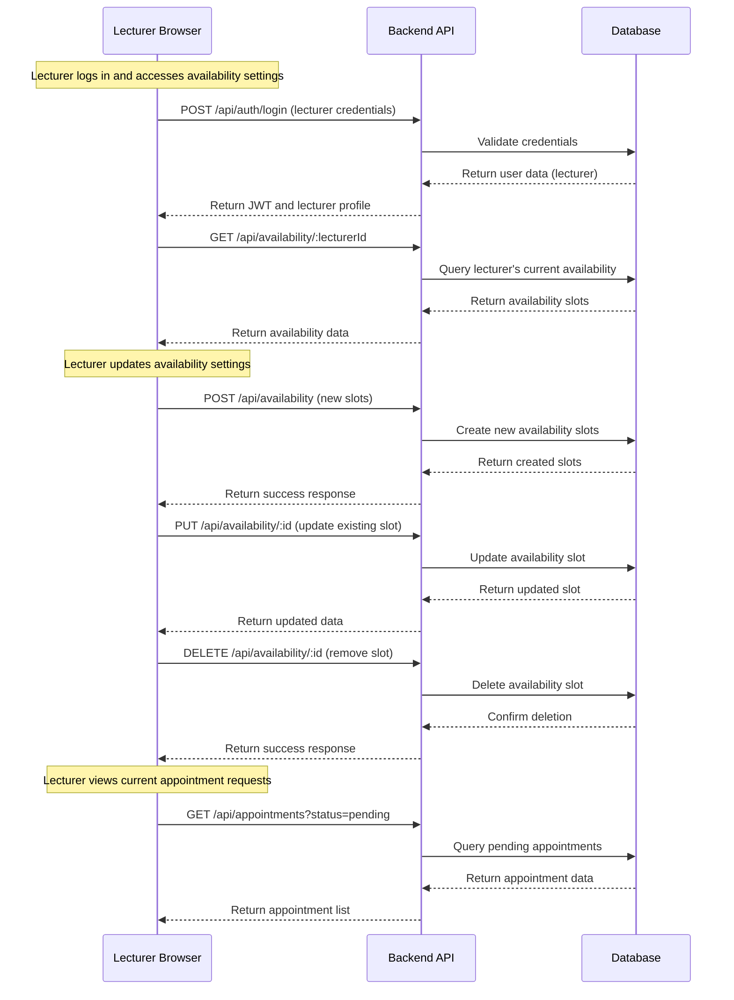
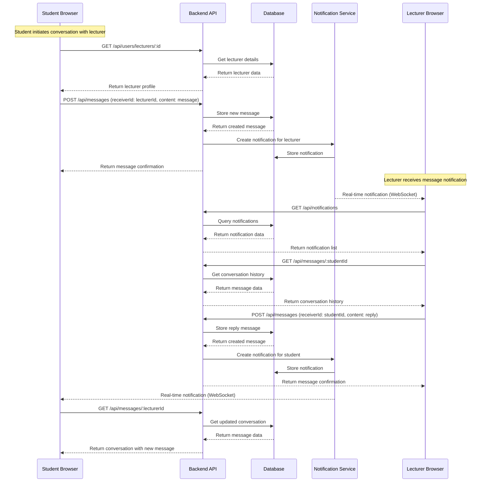

# System Decomposition

## Component Responsibilities

### 1. User Authentication
- Handle student and lecturer registration, login, and profile management.
- Provide password recovery functionality (e.g. "Forgot Password").
- Manage role-based access control (student, lecturer, HOD, secretary).

### 2. Lecturer Management
- Maintain lecturer profiles including name, email, telephone number, and office location.
- Enable searching and filtering of lecturers (as shown in the "List of Lecturers" section).
- Display lecturer availability status (available, busy, in meeting).

### 3. Appointment Scheduling
- Provide calendar interface for viewing available time slots (month/week/day views).
- Handle appointment requests, confirmations, rescheduling, and cancellations.
- Manage conflict detection for double bookings.
- Send confirmation notifications (email/in-app).

### 4. Messaging System
- Enable direct communication between students and lecturers.
- Provide message history and search functionality.
- Support notifications for new messages.

### 5. Navigation & Status Tracking
- Display real-time availability status of lecturers.
- Provide directions/maps to lecturer offices.
- Integrate with campus navigation systems if available.

### 6. Admin Dashboard
- Manage user accounts and permissions.
- Handle system configurations and settings.
- Monitor system usage and generate reports.
- Resolve scheduling conflicts or disputes.

## Program call flow

### Student Appointment Request Flow

### Lecturer Availability Management Flow

### Messaging Flow

## Scalability and Performance Considerations

1. **Database Optimization**:
   - Implement indexing on frequently queried fields
   - Use connection pooling for database connections
   - Implement database query caching for lecturer listings and availability data

2. **Caching Strategy**:
   - Redis cache for user sessions
   - Cache lecturer availability data
   - Cache campus map and location data

3. **Horizontal Scaling**:
   - Stateless API design allowing for multiple instances
   - Load balancing across API instances
   - Database read replicas for scaling read operations

4. **Performance Optimizations**:
   - Pagination for lists (lecturers, appointments, messages)
   - Lazy loading of images and non-critical data
   - Optimized API responses with only required fields
   - Client-side caching of static assets

5. **Real-time Architecture**:
   - WebSocket connection pooling
   - Message queuing for notifications (RabbitMQ/AWS SQS)
   - Event-driven architecture for appointment status changes

## Security Considerations

1. **Authentication Security**:
   - JWT with appropriate expiration
   - Secure password hashing (bcrypt)
   - HTTPS for all communications
   - Protection against brute force attacks

2. **API Security**:
   - Input validation and sanitization
   - CSRF protection
   - Rate limiting
   - Proper error handling without exposing sensitive information

3. **Data Protection**:
   - Encrypted storage of sensitive data
   - Role-based access control
   - Principle of least privilege
   - Audit logging for sensitive operations

4. **Frontend Security**:
   - XSS protection
   - Content Security Policy
   - Protection against clickjacking
